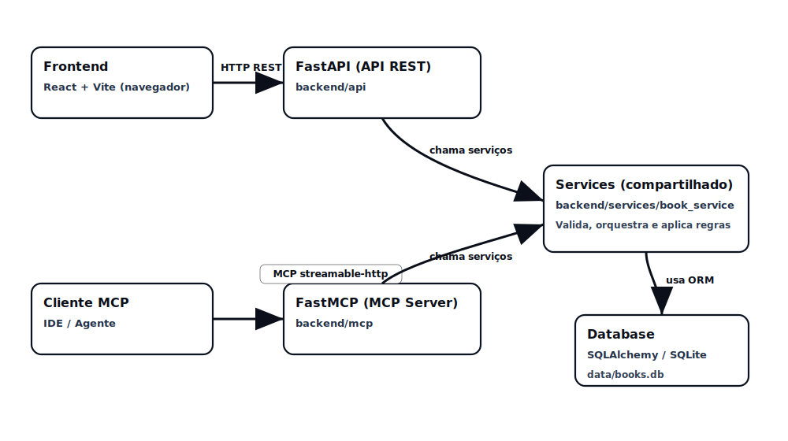

# Arquitetura detalhada



## Componentes

- **Frontend (React + Vite)**  
  Aplicacao de pagina unica que consome a API REST para listar, buscar e editar livros. Todo o estado vive em `BooksPage`.

- **API REST (FastAPI)**  
  Exposta em `/api/books`. Contem apenas logica de orquestracao (valida entrada, chama o servico e devolve HTTP).

- **Camada de servicos (`book_service`)**  
  Contem regras de negocio compartilhadas: validacao de titulo, paginacao, busca, garantias de integridade. Tudo que REST ou MCP precisa passa por aqui.

- **Persistencia (SQLAlchemy + SQLite)**  
  Modelo `Book`, funcoes CRUD e gerenciadores de sessao. Guarda os dados em `data/books.db`.

- **MCP Server (FastMCP)**  
  Roda em paralelo ao backend HTTP, lendo `backend/mcp/config_mcp.json`. Cada tool MCP chama o mesmo `book_service` usado pelo REST.

## Fluxos

### 1. Frontend → API

1. Usuario digita/edita livro na UI.
2. `frontend/src/api/books.ts` faz chamada HTTP (`GET/POST/PUT/PATCH/DELETE`).
3. `backend/api/endpoints.py` recebe a requisicao, valida com `schemas.py`.
4. `backend/services/book_service.py` aplica regras (ex.: titulo obrigatorio, limite de pagina).
5. `backend/database/crud.py` executa SQL via SQLAlchemy.
6. Resposta volta para o frontend e atualiza a tela.

### 2. Cliente MCP → Servidor MCP

1. IDE/cliente MCP conecta no FastMCP (`backend/mcp/server.py`) em `transport=streamable-http`.
2. Tools disponiveis sao carregadas a partir de `backend/mcp/config_mcp.json`.
3. Cada decorator `@server.tool` chama um metodo em `MCPBookTools`.
4. `MCPBookTools` abre uma sessao (`get_db`) e chama `book_service`.
5. `book_service` reutiliza exatamente o mesmo CRUD da API REST.
6. Resultado e enviado ao cliente MCP em formato JSON serializavel.

### 3. Camada central compartilhada

```
FastAPI endpoints  -->                --> SQLAlchemy CRUD
                      book_service
FastMCP tools     -->                --> SQLite
```

Esse desenho evita logica duplicada. Ao alterar `book_service`, tanto a API quanto as tools MCP recebem a mudanca instantaneamente.
